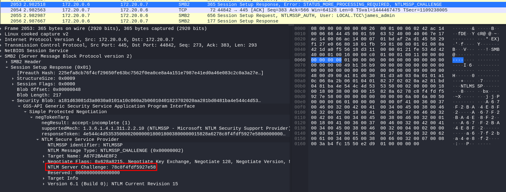
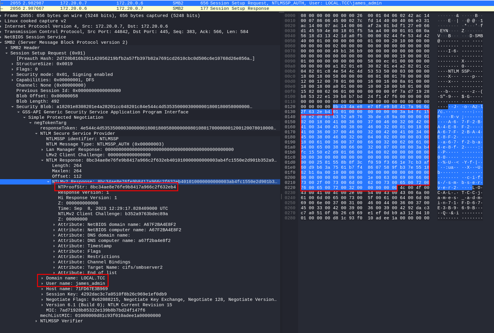
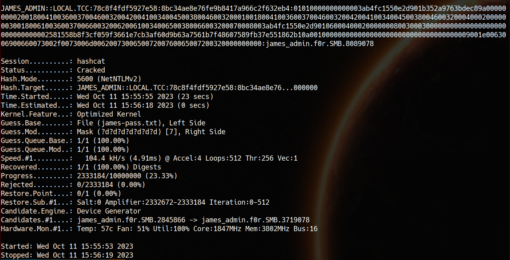

## Suspicious traffic

Points: 5

We're given a single pcap and a goal of finding file `secret.db`

A quick overview of captured traffic:
- authenticated FTP transfer of `home.tgz` and `etc.tgz` files (credentials: `james:james.f0r.FTP.3618995`, packets #324 and #327)
- SMB transfers of `history.db` and `employee.db`
- an encrypted SMB3 transfer
- authenticated HTTP (credentials `admin:james.f0r.HTTP.4648507`, packet #2337)
- a lot of DNS requests

A search for `secret.db` didn't yield anything so I went to extract the files from FTP and SMB transfers.
SMB files are easily exported in Wireshark by <em>File -> Export objects -> SMB...</em>
Files transferred over FTP can extracted by following their TCP stream and then saving raw data.
FTP transfer of `home.tgz` begins at packet #338, transfer of `etc.tgz` at packet #1443.

The `history.db` and `employees.db` don't contain any interesting information. But `home.tgz` does - it has a bash history with this line:
`openssl enc -aes-256-cbc -salt -pbkdf2 -in secret.db -out secret.db.enc -k R3alyStr0ngP4ss!`

Ok so now I know that James encrypted the file I'm looking for and fortunately even have the key but I still don't have the file.

One of the remaing places to look for it is the encrypted SMB3 transfer around packet #2057. 
A quick google search reveals that traffic can be decrypted given the knowledge of password:
https://medium.com/maverislabs/decrypting-smb3-traffic-with-just-a-pcap-absolutely-maybe-712ed23ff6a2

In order to crack the password, I'll need:
- username: `james_admin`
- domain: `LOCAL.TCC`
- NTLM Server Challenge: `78c8f4fdf5927e58`
- NTProofStr: `8bc34ae8e76fe9b8417a966c2f632eb4`
- NTLM Response: `01010000000000003ab4fc1550e2d901b352a9763bdec89a00000000020018004100360037004600320042004100340045003800460032000100180041003600370046003200420041003400450038004600320004000200000003001800610036003700660032006200610034006500380066003200070008003ab4fc1550e2d901060004000200000008003000300000000000000000000000000000002581558b8f3cf059f3661e7cb3af60d9b63a7561b7f48607589fb37e551862b10a0010000000000000000000000000000000000009001e0063006900660073002f0073006d006200730065007200760065007200320000000000`



Looking at the other 2 passwords, the expected form of the password is `james_admin.f0r.SMB.` followed by 7 digits

So we have:

<em>target.txt</em>:
```
JAMES_ADMIN::LOCAL.TCC:78c8f4fdf5927e58:8bc34ae8e76fe9b8417a966c2f632eb4:01010000000000003ab4fc1550e2d901b352a9763bdec89a00000000020018004100360037004600320042004100340045003800460032000100180041003600370046003200420041003400450038004600320004000200000003001800610036003700660032006200610034006500380066003200070008003ab4fc1550e2d901060004000200000008003000300000000000000000000000000000002581558b8f3cf059f3661e7cb3af60d9b63a7561b7f48607589fb37e551862b10a0010000000000000000000000000000000000009001e0063006900660073002f0073006d006200730065007200760065007200320000000000
```

<em>james-pass.txt</em>: `james_admin.f0r.SMB.`

Feeding this all to hashcat (`hashcat -a 6 -m 5600 target.txt james-pass.txt ?d?d?d?d?d?d?d -O`) yields `james_admin.f0r.SMB.8089078`



The password can now be inserted into Wireshark's NTLMSSP protocol (<em>Edit -> Preferences -> Protocols -> NTLMSSP</em>) and Wireshark will take care of decrypting the traffic as well.
Now the `secret.db.enc` can be exported and decrypted:
`$ openssl aes-256-cbc -d -salt -pbkdf2 -in secret.db.enc -out secret.db -k R3alyStr0ngP4ss!`
	
Dumping the `secret.db` will yield the flag:

```
$ sqlite3 secret.db '.dump'
PRAGMA foreign_keys=OFF;
BEGIN TRANSACTION;
CREATE TABLE secrets (
	secret_id INTEGER PRIMARY KEY,
	secret TEXT NOT NULL,
	value TEXT NOT NULL
);
INSERT INTO secrets VALUES(1,'FLAG','FLAG{5B9B-lwPy-OfRS-4uEN}');
COMMIT;
```
