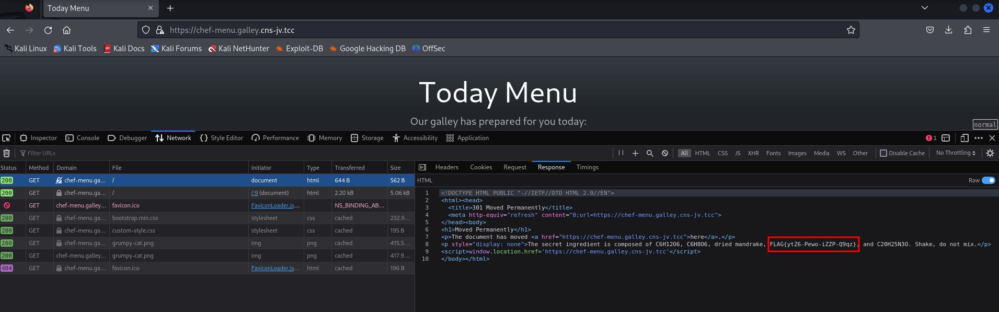

## Naval chef's recipe 

Points: 3

Nmap reports that ports 80 and 443 for chef-menu.galley.cns-jv.tcc host.
The site uses a common setup when site on port 80 just redirects to a secure site on 443.

Visiting http://chef-menu.galley.cns-jv.tcc while persisting network request logs and inspecting the port 80 response quickly yields the flag.

`FLAG{ytZ6-Pewo-iZZP-Q9qz}`
